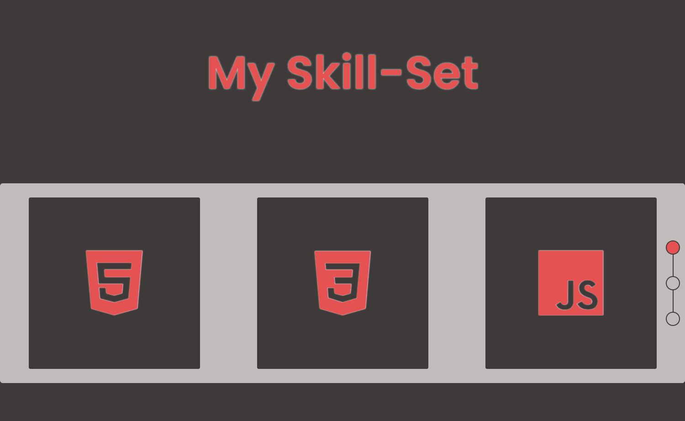

# Food App

A simple slider to showcase your skills.

## Table of contents

- [Overview](#overview)
  - [The challenge](#the-challenge)
  - [Screenshot](#screenshot)
  - [Links](#links)
- [My process](#my-process)
  - [Built with](#built-with)
- [Author](#author)
- [Acknowledgments](#acknowledgments)

## Overview

### The challenge

Users should be able to:

- Interact with the slider

### Screenshot

### Links

- Live Site URL: 

## My process

### Built with

- HTML5
- CSS3
- JavaScript

## Author

- GitHub - [quielLovesLasagna](https://github.com/quielLovesLasagna)

## Acknowledgments

I would like to thank [lashaNoz](https://github.com/lashaNoz) for the project idea.
